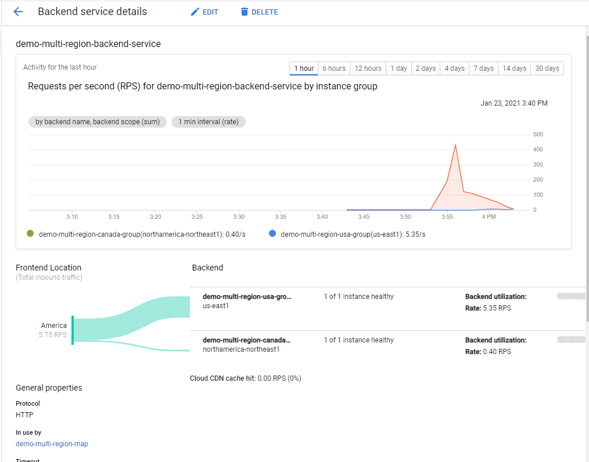

# GCP Managed Instance Groups with Global Load Balancer

This project demonstrates how to deploy a Global Load Balancer with two regional Managed Instance Groups as backends.

It deploys two Managed Instance Groups running NGINX. The USA group is located in us-east1, and the CANADA group in northamerica-northeast1.

After deploying it, you can hit the Load Balancer IP from different regions using VMs, and see how GCP is spliting the traffic, for example:

